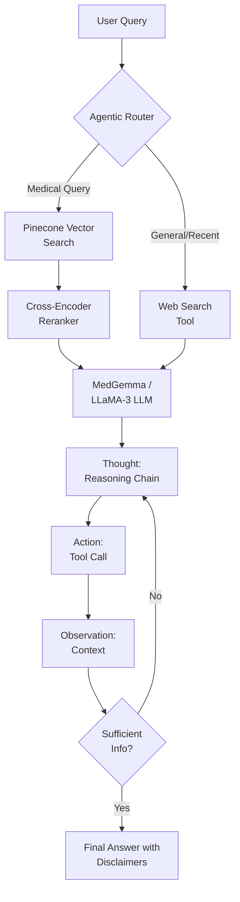
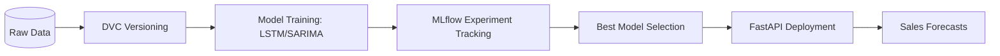
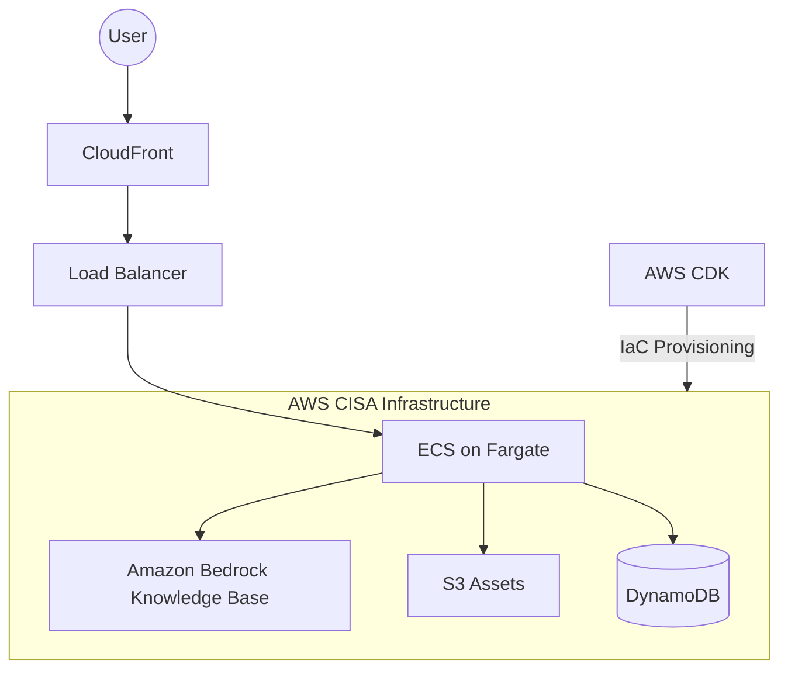
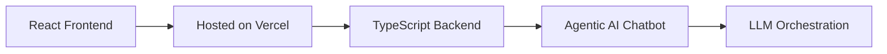

# Hi, I'm Jacob Kuriakose 👋
**Data Scientist & Machine Learning Engineer** | *MS in Data Science @ Arizona State University (GPA: 4.0)*

I specialize in building production-grade Machine Learning systems, with a focus on **GenAI (Agentic RAG)**, **MLOps**, and **Cloud Infrastructure**.

---

### 🚀 High-Impact Engineering

| Domain | Core Accomplishment | Key Result |
| :--- | :--- | :--- |
| **☁️ Cloud & MLOps** | Migrated production AI chatbot to **AWS** via **AWS CDK** | **85% ↑** Deployment Efficiency |
| **🤖 Generative AI** | Engineered Agentic **Medical Chatbot** (ReAct + LLaMA-3) | **0.84 $F1$** / **1.0 Safety** |
| **📈 Forecasting** | Optimized Walmart Sales predictions via **MLflow & DVC** | **38.92% ↓** RMSE |

---

### 📂 Featured Projects

#### 👤 Personal Projects (GenAI & Data Science)
* **[Medical Agentic RAG](https://github.com/jacobjk03/Medical_chatbot):** A GenAI system using hybrid LLM orchestration (MedGemma + LLaMA-3) and LangGraph to provide factually grounded medical reasoning.

* **[Walmart Sales Pipeline](https://github.com/jacobjk03/Data-Driven-Walmart-Sales-Predictions):** An end-to-end forecasting project featuring SARIMA/LSTM models, **MLflow** for tracking, and **DVC** for data versioning.

#### 👥 Team Projects (GenAI, MLOps & Software Dev)
* **[Waterbot (AWS Migration)](https://github.com/jacobjk03/waterbot/tree/main):** Led the transition of this AI chatbot to a CISA-compliant AWS stack (ECS, Lambda, Bedrock), slashing release times by **85%**.

* **[Navia](https://github.com/jacobjk03/Navia):** An end-to-end product integrating GenAI capabilities with full-stack software development to solve real-world user needs.

### 📂 Featured Projects

| 👤 Personal (GenAI & Data Science) | 👥 Team (MLOps & Software Dev) |
| :--- | :--- |
| **[Medical Agentic RAG](https://github.com/jacobjk03/Medical_chatbot)** Hybrid LLM orchestration (MedGemma + LLaMA-3) and LangGraph. | **[Waterbot (AWS Migration)](https://github.com/jacobjk03/waterbot/tree/main)** CISA-compliant AWS stack (ECS, Lambda, Bedrock) with **85% ↑** efficiency. |
| **[Walmart Sales Pipeline](https://github.com/jacobjk03/Data-Driven-Walmart-Sales-Predictions)** End-to-end forecasting with **MLflow** and **DVC**. | **[Navia](https://github.com/jacobjk03/Navia)** Full-stack product integrating GenAI with TypeScript and React. |

---

#### 🏗️ System Architectures

| 🩺 Medical RAG (Personal) | 🛒 Walmart Pipeline (Personal) |
| :--- | :--- |
|  |  |
| 💧 Waterbot AWS (Team) | 🧭 Navia Flow (Team) |
|  |  |

---

---

### 🛠️ Technical Toolkit

**Data Science & Machine Learning (Core)**

  
  
  
  
  
  

**Deep Learning (Computer Vision & NLP)**

  
  
  
  
  
  
  

**Generative AI & Agentic Systems**

  
  
  
  
  

**Infrastructure & MLOps**

  
  
  
  
  
  
  
  

**Languages**

  
  
  
  
  
  

**AI-First Development & IDEs**

  
  
  
  
  
  

---

### 📫 Connect with me

