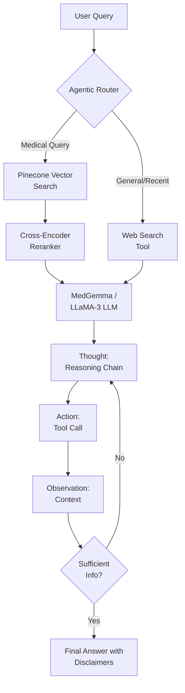
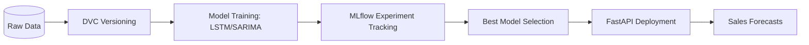
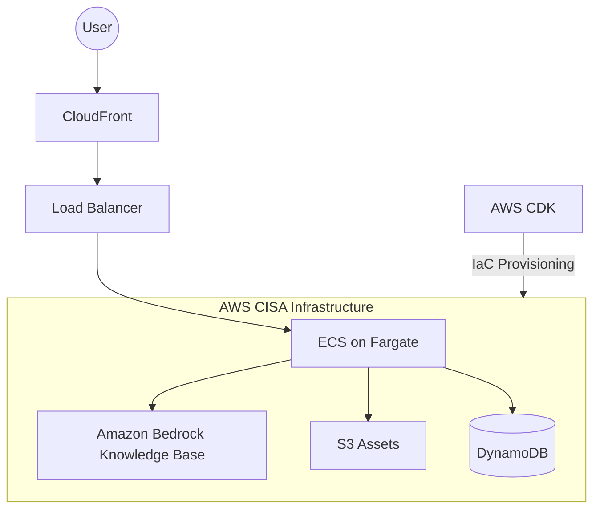
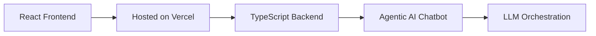

# Hi, I'm Jacob Kuriakose 👋
**Data Scientist & Machine Learning Engineer** | *MS in Data Science @ Arizona State University (GPA: 4.0)*

I specialize in building production-grade Machine Learning systems, with a focus on **GenAI (Agentic RAG)**, **MLOps**, and **Cloud Infrastructure**.

---

### 🚀 High-Impact Engineering
* **Cloud & MLOps:** Led the migration of a production-grade AI chatbot to **AWS**, improving deployment efficiency by **~85%** and reducing manual setup by **~40%** using **AWS CDK**.
* **Generative AI:** Engineered an agentic **Medical Chatbot** featuring a **ReAct** architecture with **MedGemma** and **LLaMA-3**, achieving a $F1 \approx 0.84$ for factual grounding and a **1.0 Safety score**.
* **Time Series & Forecasting:** Optimized Walmart sales predictions, achieving a **38.92% RMSE improvement** using Exponential Smoothing; integrated **MLflow** and **DVC** for full experiment tracking.

---

### 📂 Featured Projects

#### 👤 Personal Projects (GenAI & Data Science)
* **[Medical Agentic RAG](https://github.com/jacobjk03/Medical_chatbot):** A GenAI system using hybrid LLM orchestration (MedGemma + LLaMA-3) and LangGraph to provide factually grounded medical reasoning.

* **[Walmart Sales Pipeline](https://github.com/jacobjk03/Data-Driven-Walmart-Sales-Predictions):** An end-to-end forecasting project featuring SARIMA/LSTM models, **MLflow** for tracking, and **DVC** for data versioning.

#### 👥 Team Projects (GenAI, MLOps & Software Dev)
* **[Waterbot (AWS Migration)](https://github.com/jacobjk03/waterbot/tree/main):** Led the transition of this AI chatbot to a CISA-compliant AWS stack (ECS, Lambda, Bedrock), slashing release times by **85%**.

* **[Navia](https://github.com/jacobjk03/Navia):** An end-to-end product integrating GenAI capabilities with full-stack software development to solve real-world user needs.

---

### 🛠️ Technical Toolkit

### 🛠️ Technical Toolkit

**Data Science & Machine Learning (Core)**

  
  
  
  
  
  

**Deep Learning (Computer Vision & NLP)**

  
  
  
  
  
  
  

**Generative AI & Agentic Systems**

  
  
  
  
  
  

**Infrastructure & MLOps**

  
  
  
  
  
  
  
  

**Languages**

  
  
  
  
  
  

---

### 📫 Connect with me

